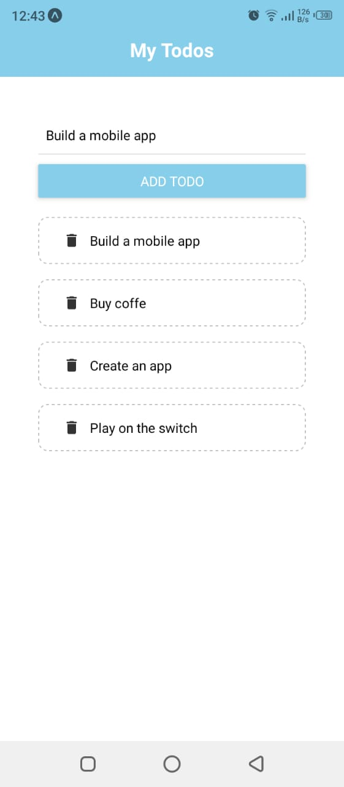

# Todmby MOBILE APP



A Simple Todos App made with React Native, this is my first mobile app to dive in cross mobile tech stack.

## Getting Started

These instructions will get you a copy of the project up and running on your local machine for development and testing purposes. See deployment for notes on how to deploy the project on a live system.

### Installing

Clone the Repository by runing

```
git clone https://github.com/jamal-Bahammou/Todmby.git
```

### Lunch the application

```
npm start
```

## Built With

- [React Native](https://reactnative.dev/)

## Contributing

Please feel free to send pull request if you want to contribute!

## Authors

- **Jamal Bahammou** - _Computer Science Student_ - [jamal-Bahammou](https://github.com/jamal-Bahammou)